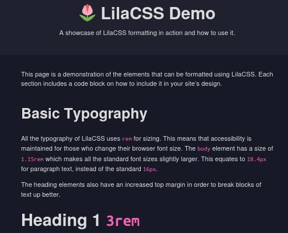
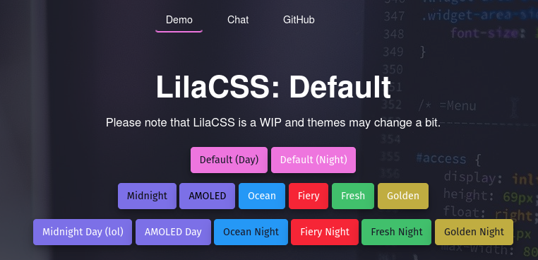
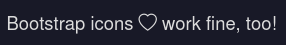

# 🌷 **LilaCSS** – The perfect balance of simplicity & features. 
## [**→** LIVE  DEMO](https://lilacss.netlify.app)
## [**→** INSTALL & USE](#use)

## [**→** My website (built with LilaCSS)](https://lilacss.netlify.app)
## [**→** Source code](https://github.com/nsde/web/blob/master/static/styles/lila.css)
***

The aim of LilaCSS is to provide a CSS framework in which classes are completely optional. The website should work fine without them, too! No need to do research just to learn how to insert a button. But on the other hand, some frameworks are so simple that they can't actually be used for bigger projects with more features than just a simple landing page!


<!--  -->
<!--  -->

*Demo with dark mode enabled*
***
### [How to see a live demo of LilaCSS](#demo-linux)

## Why LilaCSS?
### Keep that in mind...
> **If this wasn't obvious:** LilaCSS isn't perfect. It has some flaws. All of the following frameworks can actually be great, depending on your use case. And I don't think e.g. Bootstrap is a bad framework just because it doesn't meet a lot of criteria. I just highlighted some of the coolest aspects of LilaCSS!

### Table
(Somewhat opinion-based)

 Criteria                                                                                               | **LilaCSS**        | **SimpleCSS**      | **Bootstrap**      | **Milligram**      
----------------------------------------------------------------------------------------------------|--------------------|--------------------|--------------------|--------------------
 [Configure theme of whole page at once](#themes)                                                              | :heavy_check_mark: | :x:                | :x:                | :x:                
 Integrated Auto Dark-Mode                                                                          | :heavy_check_mark: | :heavy_check_mark: | :x:                | :x:                
 A [plain HTML file](https://www.december.com/html/demo/basic.html) can look good (with no changes) | :heavy_check_mark: | :heavy_check_mark: | :x:                | :x:                
 Extra features for social media-like websites                                                      | :heavy_check_mark: | :x:                | :heavy_check_mark: | :x:                
 Animations                                                                                         | :heavy_check_mark: | :x:                | :heavy_check_mark: | :x:                
 Color scheme can be easily edited (file)                                                           | :heavy_check_mark: | :heavy_check_mark: | :heavy_check_mark: | :x:                
 Maintained                                                                                         | :heavy_check_mark: | :heavy_check_mark: | :heavy_check_mark: | :x:                
 No "Overused"-like design                                                                          | :heavy_check_mark: | :heavy_check_mark: | :x:                | :heavy_check_mark: 
 No frequent use of "!important"                                                                    | :heavy_check_mark: | :heavy_check_mark: | :x:                | :heavy_check_mark: 
 Lightweight                                                                                        | :heavy_check_mark: | :heavy_check_mark: | :x:                | :heavy_check_mark: 
 Pretty easy to use (also looks good without a lot of classes)                                               | :heavy_check_mark: | :heavy_check_mark: | :x:                | :heavy_check_mark: 
 Useful extra features (classes etc.)                                                               | :heavy_check_mark: | :x:                | :heavy_check_mark: | :heavy_check_mark: 


***
### Themes
So what actually *is* so special about LilaCSS?
See, you can change the whole color scheme by just-
```html
<body class="ocean night">
```
*done*. It's as easy as that. Pick something from below.



### Soo...

- Quite simple to use
- Works without JavaScript
- Auto Dark Mode
- Responsive
- Lightweight
- Almost no `!important` tags, you decide what's actually important ;)
  - Exceptions:
    - `*::selection`, basically just the highlighting color of a text field when holding down & moving the cursor, nothing too important

### Advantages over Simple.css
- More modern style
  - Animations
  - Shadows
  - New dark mode
  - Improved color scheme

- More features for blogging & articles
  - Article info card `text-box`

- Tools
  - [Rows](docs/structure.md#Rows) `w-<n>`
  - [Dark Mode auto-invertion of images](docs/classes.md#Dark+Invert+for+Images) `dark-invert`

## Use
### CDN (easiest)
Don't worry, the framework probably won't change that much in near future that I'll break your whole website ;).

```html
<link href="https://onlix.me/lila.css" rel="stylesheet">
```
  
### Download (wget)
The following command can be ran on Linux-based systems with `wget` installed.

Run this in the directory of your website :
```sh
wget -O style.css https://onlix.me/lila.css
```

and insert this to your HTML file:

```html
<link href="style.css" rel="stylesheet">
```

in your HTML file.

## Local Demo Setup (Linux)
Want to run the demo locally on your Linux system?

```sh
cd ~/Downloads/ # to avoid annoyance with the file being in the root directory
rm -rf lilacss # remove folder if it already exists
mkdir lilacss && cd lilacss # prepare folders
wget -O lila.css.zip https://codeload.github.com/nsde/lilacss/zip/refs/heads/main > /dev/null 2>&1 # download
unzip lila.css.zip > /dev/null 2>&1 && rm lila.css.zip # install and remove the unneeded zip file 
xdg-open lilacss-main/examples/demo.html # show
clear && echo "Done! Showing LilaCSS demo in Firefox" # info message
```

## FAQ
### How can I use icons?
I decided not to add my own icons because first of all, I'm not a professional when it comes like this, and I'd take weeks for a acceptable amount of icons, which I think wouldn't be worth it considering there ar  e already tons of great icon frameworks out there: 

Add the stylesheet to your html:

```html
<link rel="stylesheet" href="https://cdn.jsdelivr.net/npm/bootstrap-icons@latest/font/bootstrap-icons.css">
```

Search for an icon [icons.getbootstrap.com](https://icons.getbootstrap.com) and add it:

```html
<!-- Example: icon called "heart" -->
<i class="bi bi-heart"></i>
```

Works great!

### Why did you create this framework?
The reason is basically that I think my theme just looks more modern, I especially think my dark mode looks quite nice.  

I created LilaCSS because don't like its borders and the color theme. Of course, you can just take a moment to configure it, but I just want my theme to look great out of the box!

Also, want my framework to have a lot of additional features without making it complicated to set up.

### Where's the source code?
I decided to move it to [my website's GitHub repository](https://github.com/nsde/web/commits/master/static/styles/lila.css) because I had some issues with caching. Sorry. It's still FOSS though, so nothing to be upset about.

→ [Source code](https://github.com/nsde/web/blob/master/static/styles/lila.css)

→ [Git Blame](https://github.com/nsde/web/blame/master/static/styles/lila.css)

→ [Raw (don't use this as the CDN!!!)](https://raw.githubusercontent.com/nsde/web/master/static/styles/lila.css)

## Credits & License
This project is based on Simple.css:
- https://github.com/kevquirk/simple.css/blob/main/LICENSE

Support the team of Simple.css:
- https://github.com/sponsors/kevquirk
- https://ko-fi.com/kevquirk