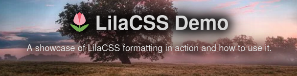
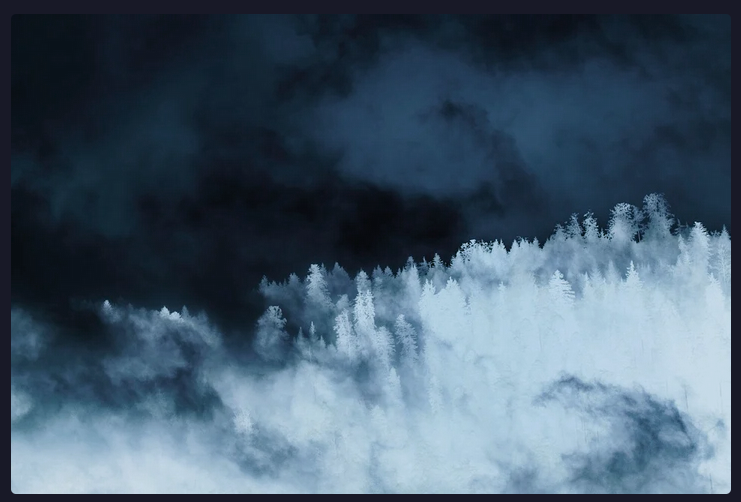

# Classes
## Header Image
```html
<header
    class="text-shadow"
    style="--image: url('image.jpg')"
>
```
### Result



## Light/Dark Invert for Images
```html
<!-- Invert image if dark mode is enabled -->


<!-- Invert image if light mode is enabled -->

```

This class can be quite useful for icons & simple backgrounds, but I wouldn't recommend it for colorful or  just complex pictures, as it makes them [look horrible](media/horrible.png).

But how does it work? It's quite simple: pictures with this class will get inverted, as well as its color/hue whenever the browser/operating system is in dark mode.

### Result
Light theme with `dark-invert`

Shows the original image, because dark mode is off.

Dark theme with `dark-invert`

Show the inverted image, because dark mode is on.

## Hover Inversion
Inverts the color of the element when hovered. Quite simple.

```html

```