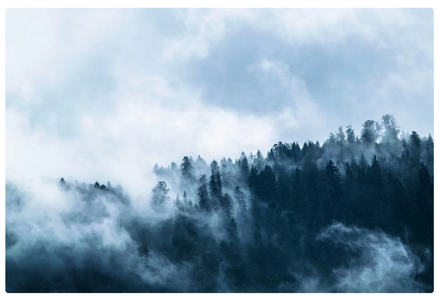
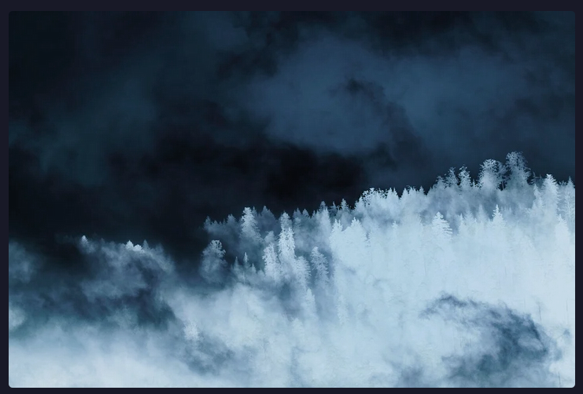

# Classes

## Dark Invert for Images
```html
 
```

This class can be quite useful for icons & simple backgrounds, but I wouldn't recommend it for colorful or  just complex pictures, as it makes them [look horrible](horrible.png).

But how does it work? It's quite simple: pictures with this class will get inverted, as well as its color/hue whenever the browser/operating system is in dark mode.

### Light

### Dark
