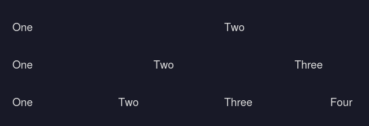

# Example structure
## Rows
```html
<div class="row">
    <p class="w-2">One</p>
    <p class="w-2">Two</p>
</div>

<div class="row">
    <p class="w-3">One</p>
    <p class="w-3">Two</p>
    <p class="w-3">Three</p>
</div>

<div class="row">
    <p class="w-4">One</p>
    <p class="w-4">Two</p>
    <p class="w-4">Three</p>
    <p class="w-4">Four</p>
</div>
```
... and so on:




## Blog
(heavily simplified, of course)
```css
- body
    - header
        - nav 
            - a
            - a
            - svg /* Social Media Icons */
    - main

        - div class="text-box article-info" /* Basically just a box */
            - p
            /* or, for a more detailed info-box: */
            - p.reading-time
            - p.published
            - p.author
    - footer
        - socials
```

### Info Box (Small)


### Info Box (Large )
