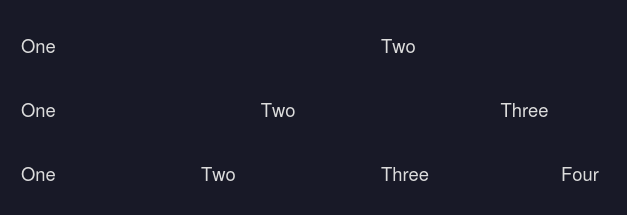

# Example structure
## Cards

### Simplified example
```css
- div.cards
    - div.card
        - img
        - h4
        - p
        - a
    - ...
```

### Actual example code
```html
<div class="cards">
    <div class="card" onclick="window.location.href = 'blog/log4shell';">
        
        <h4>Log4Shell Info</h4>
        <p>Lorem ipsum dolor sit amet</p>
        <a href="#">Learn more...</a>
    </div>
    <div class="card" onclick="window.location.href = 'blog/example';">
        
        <h4>Example text</h4>
        <p>Lorem ipsum dolor sit amet</p>
        <a href="#">Learn more...</a>
    </div>
</div>
```

## Rows
```html
<div class="row">
    <p class="w-2">One</p>
    <p class="w-2">Two</p>
</div>

<div class="row">
    <p class="w-3">One</p>
    <p class="w-3">Two</p>
    <p class="w-3">Three</p>
</div>

<div class="row">
    <p class="w-4">One</p>
    <p class="w-4">Two</p>
    <p class="w-4">Three</p>
    <p class="w-4">Four</p>
</div>
```
... and so on:




## Blog
### Simplified example
```css
- body
    - header
        - nav 
            - a
            - a
            - svg /* Social Media Icons */
    - main

        - div class="text-box article-info" /* Basically just a box */
            - p
            /* or, for a more detailed info-box: */
            - p.reading-time
            - p.published
            - p.author
    - footer
        - socials
```

## Info Box (Simple)
```html
<div class="text-box article-info">
    <p>
        by <strong>ONLIX</strong>・ <strong>Mar 14, 2022</strong>
    </p>
</div>
```


## Info Box (Detailed)

```html
<div class="text-box article-info">
    <p class="author">ONLIX</p>
    <p class="published">Mar 14, 2022</p>
    <p class="reading-time">5</p>
</div>
```

The emojis & text will be added automatically. If you don't like how it looks, just use your custom `<p>` elements without the classes.

